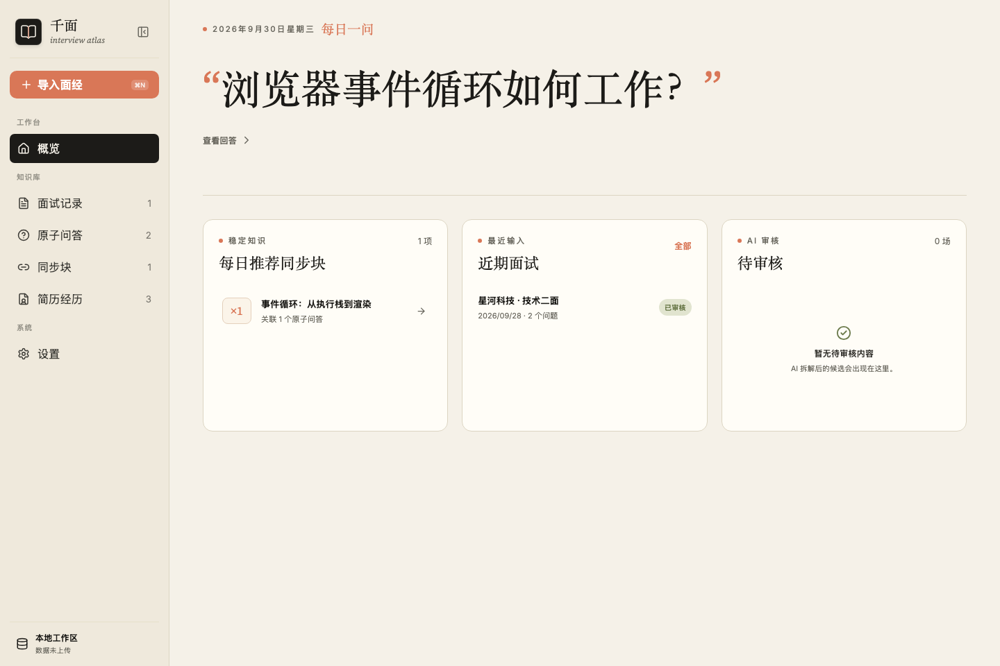

# Interview Atlas

> **千面** is a local-first workspace that turns scattered interview notes into reviewable, reusable knowledge.

[中文说明](README.zh-CN.md) · [Download](https://github.com/an-an-618/interview-atlas/releases) · [Product context](docs/product/product-context.md) · [PRD](docs/product/prd-v1.md) · [Architecture decisions](docs/adr/README.md)

[](https://github.com/an-an-618/interview-atlas/actions/workflows/ci.yml)




## What it does

Interview Atlas preserves the original interview record as evidence, extracts concrete atomic Q&A instances, and connects recurring questions to synchronized blocks that hold a stable answer. AI proposes candidates; the user reviews every persisted change.

```text
Interview record → Atomic Q&A → Synchronized block → Review
        │                │               │
      evidence        instance      stable answer
```

The current application includes:

- responsive desktop and mobile workflows from one React codebase;
- a macOS Apple Silicon `.app` and `.dmg` built with Tauri 2;
- local persistence in the browser through IndexedDB;
- interview import, manual structuring, and AI-assisted extraction review;
- standalone atomic Q&A with editable questions, answers, and notes;
- synchronized blocks with explicit, bidirectional relationships;
- resume experiences with CRUD, relationship management, and diff preview;
- a daily question, recommended synchronized blocks, and an AI review queue;
- versioned JSON export, explicit demo data, and workspace deletion;
- OpenAI-compatible providers with session-only API keys.

## Product rules

- **Original text is evidence.** Derived content never replaces its source.
- **AI suggests; the user decides.** No silent overwrite, merge, link, or deletion.
- **Local-first is the default.** Workspace data stays in IndexedDB unless the user exports it.
- **AI requests are explicit.** Selected content is sent directly to the configured provider only after a user action.
- **Manual workflows remain complete.** The knowledge base works without AI configuration.

## Install on macOS

The current desktop preview supports Apple Silicon Macs running macOS 13 or later.

1. Open [GitHub Releases](https://github.com/an-an-618/interview-atlas/releases) and download the newest `Interview-Atlas_<version>_aarch64.dmg` plus `SHA256SUMS.txt`.
2. Open the DMG and drag `千面.app` onto the `Applications` shortcut.
3. The preview is not Apple-notarized yet. For the first launch, Control-click `千面.app` in Finder, choose **Open**, then confirm **Open** again. If needed, use **System Settings → Privacy & Security → Open Anyway**.
4. Later, launch 千面 from Applications, Spotlight, Launchpad, or the Dock.

Do not disable system-wide Gatekeeper. Verify the download with:

```bash
shasum -a 256 -c SHA256SUMS.txt
```

The desktop app and browser version use separate IndexedDB workspaces. Browser data is not migrated automatically. For maintainer builds and future signing/notarization, see the [macOS distribution guide](docs/engineering/macos-distribution.md).

## Run locally

Requirements: Node.js 24 and npm 11.

```bash
npm ci
npm run dev
```

Vite serves the app on the local URL printed in the terminal. No backend or account is required.

| Command | Purpose |
| --- | --- |
| `npm run dev` | Start the local development server |
| `npm run desktop:dev` | Start the macOS desktop application in development mode |
| `npm run desktop:build` | Build the macOS `.app` and `.dmg` |
| `npm test` | Run the Vitest suite |
| `npm run typecheck` | Run TypeScript project checks |
| `npm run build` | Create a production build |

Desktop builds also require Rust and the Xcode Command Line Tools. See the [macOS distribution guide](docs/engineering/macos-distribution.md) for setup, artifacts, signing, and notarization.

## Architecture

- React 19.3, TypeScript 7, and Vite 8
- framework-independent domain operations in `src/domain/`
- a repository boundary over native IndexedDB in `src/data/`
- optional OpenAI-compatible integration in `src/ai/`
- a thin Tauri 2 wrapper in `src-tauri/`
- locally bundled Inter, Source Serif 4, and JetBrains Mono fonts
- responsive PC/H5 interface without a server dependency

## Repository guide

| Path | Contents |
| --- | --- |
| `src/` | Application, domain rules, persistence, AI boundary, and tests |
| `src-tauri/` | macOS desktop shell, bundle metadata, and application icon |
| `docs/product/` | Product context, approved PRD, and AI capability plan |
| `docs/adr/` | Accepted architecture decision records |
| `docs/engineering/` | Delivery and third-party policies |
| `.github/` | Issue forms and pull request template |
| `AGENTS.md` | Repository rules for contributors and coding agents |

Read [CONTRIBUTING.md](CONTRIBUTING.md) before proposing changes. Security and privacy reports follow [SECURITY.md](SECURITY.md).

## Scope

This is an active foundation release, not a hosted service. The first desktop preview targets Apple Silicon macOS; Windows, Linux, Intel/Universal macOS, signing, notarization, and automatic updates remain future work. Cloud sync, collaboration, automatic applications, recording, video, and real-time transcription are deliberately out of scope for the first release.
