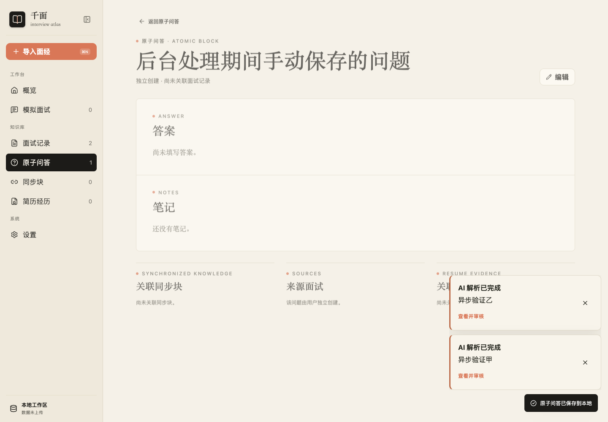

# 面经后台处理验证

关联 Issue #15。后台执行范围为当前应用会话；关闭弹窗、切换页面不取消，刷新页面或退出应用后显示中断，可手动重试。

## 自动验证

```sh
npm test
npm run build
```

队列测试覆盖 FIFO、重复提交、显式取消、晚到结果、失败后继续下一条、本地保存失败、持久化完成后通知、重新提交和列表排序。领域测试覆盖源文本/任务 ID 校验、工作区替换、并发手动编辑和重新打开后的中断状态。

浏览器回归脚本使用隔离的 Chrome context、虚构面经和拦截的模型响应，不访问真实模型服务，不读取用户数据。先启动 Vite，再用独立用户目录启动 Chrome：

```sh
npm run dev -- --host 127.0.0.1 --port 43225
# macOS，另一个终端；验证结束后退出该 Chrome 进程。
"/Applications/Google Chrome.app/Contents/MacOS/Google Chrome" \
  --headless=new --use-mock-keychain --password-store=basic \
  --user-data-dir="$PWD/.chrome-extraction-check" \
  --remote-debugging-port=9335 --no-first-run about:blank
```

通过 `PLAYWRIGHT_MODULE` 指向验证环境中已有的 Playwright 模块后运行：

```sh
node scripts/check-background-extraction.mjs
```

可选变量：`APP_URL`、`CHROME_CDP`、`SCREENSHOT_PATH`。Chrome 用户目录和截图无需提交。项目运行时没有新增依赖。

已验证：点击弹窗外部、Esc、排队、概览侧栏、面试列表排序、并发手动问答保存、两条完成通知、PC/H5 通知跳转与采纳、通知已读持久化、刷新中断。测试模型返回确定性数据；真实模型的耗时和提取质量仍受所选服务影响。


